# Real-Time Meme Photo Generator

> ⚠️ **Deprecated direction:** This browser/photo-generator plan has been replaced by the [Python desktop instant-edit plan](python-desktop-plan.md).

_Dokumen planning produk dan teknis untuk aplikasi capture foto real-time dengan hasil edit meme di panel samping._

---

## 📋 Ringkasan project

Project ini adalah aplikasi interaktif yang menampilkan kamera pengguna secara live di panel kiri. Saat pengguna menekan tombol capture, aplikasi mengambil satu frame kamera, menerapkan template edit meme bergaya sigma/aura farming, lalu menampilkan hasil edit di panel kanan secara langsung.

Ini bukan video editor dan bukan aplikasi penilaian confidence. Produk yang direncanakan adalah **real-time photo meme generator** dengan pola:

\`\`\`text
Live camera → Capture photo → Apply meme template → Edited result
\`\`\`

Panel kiri adalah sumber/input. Panel kanan adalah hasil/output. Face detection membantu menentukan crop dan posisi wajah; aplikasinya tidak perlu mengenali identitas pengguna.

## 🎯 Tujuan dan batasan

### Tujuan produk

- Capture foto webcam dengan cepat
- Menghasilkan edit meme otomatis
- Menampilkan foto asli dan hasil edit berdampingan
- Menyediakan preset gaya sigma/aura farming
- Memungkinkan retake dan pergantian template
- Mengunduh hasil sebagai PNG atau JPEG

### Batasan MVP

- Foto tunggal, bukan editing video
- Satu wajah utama per foto
- Template preset, bukan editor bebas
- Pemrosesan lokal di browser
- Tanpa akun dan database
- Tanpa generative AI pada tahap awal

### Di luar scope MVP

- Timeline video multi-track
- Beat detection
- Face recognition
- Feed sosial dan komentar
- Marketplace template
- Training model AI sendiri

## 👤 Pengalaman pengguna

Pengguna membuka aplikasi, memberikan izin kamera, memilih template, mengatur posisi wajah, lalu menekan capture. Foto asli tetap terlihat di panel kiri; foto meme yang sudah dikomposisikan muncul di panel kanan tanpa berpindah halaman.

### User journey

\`\`\`mermaid
flowchart LR
    accTitle: User Capture Journey
    accDescr: Alur dari membuka kamera sampai mengunduh hasil foto meme.

    open_app[Open app] --> camera_permission[Grant camera permission]
    camera_permission --> live_camera[Live camera preview]
    live_camera --> select_template[Select template]
    select_template --> capture[Capture photo]
    capture --> detect[Detect face]
    detect --> compose[Compose meme]
    compose --> result[Show result beside camera]
    result --> retake[Retake]
    result --> download[Download]
    retake --> capture
\`\`\`

## 🎨 Gaya edit berdasarkan referensi

Gaya visual yang dituju adalah meme edit TikTok dengan karakter dramatis, absurd, atau intimidating. Referensi menunjukkan close-up karakter, reaction image, footage cinematic, teks besar, color grading, dan outro sosial.

| Elemen | Arahan |
| --- | --- |
| Tone | Dramatis, lucu, absurd, intimidating |
| Warna | Hitam-putih, kontras tinggi, red/cyan accent |
| Komposisi | Wajah pengguna sebagai fokus utama |
| Asset | Character, reaction face, simbol, glow, smoke |
| Teks | Pendek, uppercase, tebal, punchy |
| Output | Composite image di panel kanan |
| Interaksi | Capture cepat dan hasil langsung terlihat |

### Template awal

1. **Character comparison** — foto pengguna dan karakter pembanding berdampingan
2. **Aura farming** — background dramatis, glow, shadow, vignette
3. **Reaction meme** — foto pengguna dengan satu atau lebih reaction image
4. **Cinematic poster** — crop poster, judul besar, subtitle, frame
5. **Split comparison** — dua area foto dengan label atau caption

## 🏗️ Arsitektur MVP

MVP sebaiknya client-side. Kamera, capture, deteksi wajah, compositing, preview, dan export dapat berjalan di browser. Foto tidak perlu di-upload ke server.

\`\`\`mermaid
flowchart TB
    accTitle: MVP System Architecture
    accDescr: Arsitektur browser untuk menangkap foto dan menampilkan hasil meme di panel kedua.

    user[User] --> camera[Webcam stream]
    camera --> capture[Capture controller]
    capture --> detector[Face detector]
    capture --> compositor[Canvas compositor]
    detector --> compositor
    templates[Template and assets] --> compositor
    compositor --> result[Result panel]
    result --> export[PNG or JPEG export]
    export --> user
\`\`\`

### Komponen sistem

| Komponen | Tanggung jawab | Pilihan |
| --- | --- | --- |
| Camera controller | Membuka dan menghentikan stream | MediaDevices API |
| Capture controller | Mengambil frame video | HTML video + Canvas |
| Face detector | Bounding box dan landmark opsional | MediaPipe Tasks Vision |
| Template engine | Membaca konfigurasi layer | TypeScript |
| Compositor | Menggabungkan semua layer | Canvas 2D |
| Result preview | Menampilkan output | React component |
| Exporter | Membuat file download | Canvas toBlob |
| Asset registry | Metadata gambar dan font | JSON + static assets |

## 🧰 Stack yang disarankan

| Area | Teknologi | Alasan |
| --- | --- | --- |
| Frontend | React + TypeScript | UI component dan type safety |
| Build | Vite | Setup client-side ringan |
| Styling | Tailwind CSS | Layout panel dan responsive design |
| Webcam | navigator.mediaDevices.getUserMedia | Akses kamera browser |
| Detection | MediaPipe Face Detection/Landmarker | Deteksi wajah lokal |
| Composition | HTML Canvas 2D | Crop, layer, teks, filter |
| State | React state atau Zustand | Status kamera, template, hasil |
| Export | Canvas toBlob | PNG/JPEG tanpa server |
| Testing | Vitest + Testing Library | Unit dan component test |
| Quality | ESLint + Prettier | Konsistensi kode |

Backend belum diperlukan. Backend baru dipertimbangkan untuk akun, gallery, penyimpanan hasil, dashboard template, cloud rendering, atau asset management.

## 🖥️ Spesifikasi UI

\`\`\`text
┌─────────────────────────────────────────────────────────┐
│ Aura Meme Generator                 [Template ▼]        │
├──────────────────────────────┬──────────────────────────┤
│                              │                          │
│        LIVE CAMERA           │       EDITED RESULT      │
│   Face guide / live preview  │       Meme composite     │
│                              │                          │
├──────────────────────────────┴──────────────────────────┤
│ [Capture] [Retake] [Download] [Turn camera off]         │
└─────────────────────────────────────────────────────────┘
\`\`\`

### Komponen UI

| Komponen | Fungsi |
| --- | --- |
| AppShell | Layout aplikasi |
| Header | Nama app dan template selector |
| CameraPanel | Live webcam |
| FaceGuideOverlay | Bounding box atau guide |
| CaptureButton | Memulai capture |
| TemplateSelector | Memilih preset |
| ResultPanel | Menampilkan hasil edit |
| ProcessingState | Loading saat komposisi |
| ResultActions | Retake dan download |
| PermissionState | Kamera belum diizinkan |
| ErrorNotice | Error yang dapat dipahami |

### State utama

\`\`\`mermaid
stateDiagram-v2
    accTitle: Capture UI State
    accDescr: State aplikasi dari kamera belum aktif sampai hasil edit tersedia.

    [*] --> camera_pending
    camera_pending --> camera_ready: permission granted
    camera_pending --> camera_denied: permission denied
    camera_ready --> capturing: capture clicked
    capturing --> processing: frame captured
    processing --> result_ready: render complete
    processing --> error: render failed
    result_ready --> camera_ready: retake clicked
    error --> camera_ready: retry clicked
\`\`\`

## 📸 Alur teknis capture

1. Minta izin kamera saat pengguna memulai fitur.
2. Tampilkan stream pada elemen video.
3. Pastikan video sudah memiliki ukuran dan frame yang siap.
4. Gambar frame ke canvas sementara.
5. Jalankan face detection pada frame.
6. Hitung crop berdasarkan bounding box wajah.
7. Muat konfigurasi template aktif.
8. Render background, foto, asset, teks, dan effect secara berurutan.
9. Tampilkan canvas output di panel kanan.
10. Ubah canvas menjadi blob saat pengguna menekan download.

### Data face detection

Data minimum:

- Bounding box
- Titik tengah wajah
- Lebar dan tinggi wajah
- Confidence score
- Landmark opsional mata, hidung, dan mulut

Jika wajah tidak terdeteksi, gunakan crop tengah sebagai fallback. Face detection hanya dipakai untuk komposisi, bukan identifikasi.

### Urutan layer

1. Background
2. Foto pengguna
3. Crop atau mask wajah
4. Filter warna
5. Character atau reaction asset
6. Glow, shadow, smoke, particles
7. Teks utama
8. Border dan decorative frame
9. Watermark opsional

## 🧩 Template system

Template disimpan sebagai konfigurasi agar penambahan gaya baru tidak membutuhkan perubahan besar pada UI.

\`\`\`json
{
  "id": "sigma_split_01",
  "name": "Sigma Split",
  "canvas": { "width": 1080, "height": 1080 },
  "photo": {
    "crop": "face_centered",
    "position": "left",
    "filter": "high_contrast_bw"
  },
  "assets": [
    {
      "type": "image",
      "src": "/assets/characters/character-01.png",
      "x": 620,
      "y": 120,
      "width": 360,
      "height": 520
    }
  ],
  "text": [
    {
      "content": "AURA",
      "x": 540,
      "y": 820,
      "fontSize": 86,
      "color": "#ff3131"
    }
  ],
  "effects": ["vignette", "grain", "red_glow"]
}
\`\`\`

### Tipe layer

| Layer | Contoh |
| --- | --- |
| background | Warna atau gambar latar |
| photo | Foto capture |
| image | Character, reaction, logo |
| text | Punchline, nama, label |
| shape | Frame, bar, garis |
| filter | Grayscale, contrast, tint |
| effect | Glow, shadow, grain, vignette |

### Validasi template

- ID template unik
- Ukuran canvas valid
- Asset tersedia
- Posisi dan ukuran layer valid
- Font fallback tersedia
- Warna valid
- Jumlah layer berada dalam batas aman
- Template memiliki fallback bila wajah tidak ditemukan

## 🗂️ Struktur project

\`\`\`text
aura-farming-edit/
├── public/
│   ├── assets/
│   │   ├── backgrounds/
│   │   ├── characters/
│   │   ├── reactions/
│   │   ├── effects/
│   │   └── fonts/
│   └── templates/
│       ├── sigma-split.json
│       ├── aura-farming.json
│       └── cinematic-poster.json
├── src/
│   ├── components/
│   │   ├── CameraPanel.tsx
│   │   ├── ResultPanel.tsx
│   │   ├── TemplateSelector.tsx
│   │   ├── CaptureButton.tsx
│   │   └── ResultActions.tsx
│   ├── features/
│   │   ├── camera/
│   │   ├── face-detection/
│   │   ├── compositing/
│   │   └── templates/
│   ├── lib/
│   │   ├── canvas.ts
│   │   ├── image.ts
│   │   └── validation.ts
│   ├── types/
│   │   ├── camera.ts
│   │   ├── face.ts
│   │   └── template.ts
│   ├── App.tsx
│   └── main.tsx
├── docs/
│   └── project-plan.md
├── tests/
├── package.json
└── README.md
\`\`\`

## 🔒 Privasi dan keamanan

- Minta permission kamera hanya saat fitur dimulai
- Jangan menyimpan stream kamera
- Jangan upload foto secara default
- Proses capture secara lokal
- Tampilkan indikator kamera aktif
- Sediakan tombol mematikan kamera
- Hapus object URL yang sudah tidak diperlukan
- Jelaskan bahwa aplikasi tidak melakukan face recognition

Jika cloud storage ditambahkan, harus ada penjelasan tentang tujuan upload, masa penyimpanan, dan penghapusan data.

## ⚡ Performa

| Area | Target MVP |
| --- | --- |
| Preview | Stabil tanpa freeze |
| Capture | Langsung memulai processing |
| Render | Responsif untuk asset lokal |
| Export | PNG/JPEG berkualitas |
| Responsive | Desktop dan mobile browser |
| Fallback | Tetap menghasilkan output tanpa deteksi wajah |

Optimasi yang disarankan:

- Preview resolution lebih rendah daripada export resolution
- Preload asset template
- Gunakan ImageBitmap untuk decoding
- Batasi ukuran gambar asset
- Hindari redraw yang tidak perlu
- Gunakan worker bila compositing menjadi berat

## 🧪 Testing plan

### Unit test

- Validasi template
- Perhitungan crop wajah
- Posisi layer relatif terhadap wajah
- Fallback tanpa wajah
- Export canvas menjadi blob

### Component test

- Status permission kamera
- Tombol capture disabled sebelum kamera siap
- Result panel berubah setelah render
- Template selector mengganti template
- Retake menghapus hasil lama
- Error dapat di-retry

### Manual test

- Kamera laptop
- Webcam USB
- Browser Chromium, Firefox, dan Safari target
- Ruangan terang dan gelap
- Wajah dengan kacamata
- Wajah sebagian tertutup
- Tidak ada wajah
- Permission ditolak

## 🛣️ Roadmap

Implementasi dibagi menjadi fase berurutan. Setiap fase harus menghasilkan fitur yang dapat dijalankan dan diuji sebelum masuk ke fase berikutnya.

### Fase 0 — Product freeze dan persiapan asset

**Tujuan:** Mengunci definisi MVP agar implementasi tidak melebar.

**Task:**

- Finalisasi layout dua panel
- Pilih satu ukuran output awal, misalnya 1080 × 1080
- Pilih satu template meme sebagai template pertama
- Kumpulkan background, character, reaction, font, dan effect
- Pastikan asset original atau memiliki izin penggunaan
- Buat wireframe sederhana
- Tentukan nama dan identitas visual aplikasi

**Output:** Product brief, wireframe, daftar asset, dan satu spesifikasi template.

**Selesai jika:** Tim dapat menjelaskan input, proses capture, dan hasil output tanpa asumsi baru.

### Fase 1 — App shell dan camera preview

**Tujuan:** Membuat aplikasi dapat membuka dan menampilkan webcam.

**Task:**

- Setup React, TypeScript, Vite, dan styling
- Buat `AppShell`, `Header`, `CameraPanel`, dan `ResultPanel`
- Integrasikan akses webcam
- Tampilkan loading saat permission diminta
- Tangani permission ditolak dan device tidak tersedia
- Tambahkan tombol start dan stop camera
- Pastikan layout desktop dan mobile tidak rusak

**Output:** Halaman dua panel dengan live camera di panel kiri dan placeholder di panel kanan.

**Selesai jika:** Kamera dapat dinyalakan dan dimatikan tanpa reload halaman.

### Fase 2 — Capture dan result preview

**Tujuan:** Membuktikan alur utama capture foto sampai tampil di panel hasil.

**Task:**

- Tambahkan tombol capture
- Ambil satu frame dari elemen video
- Simpan frame sebagai canvas atau image blob
- Tampilkan foto hasil capture di panel kanan
- Tambahkan tombol retake
- Tambahkan tombol download PNG/JPEG
- Tambahkan status `ready`, `capturing`, `processing`, dan `result`

**Output:** Aplikasi yang sudah memiliki alur end-to-end tanpa efek meme.

**Selesai jika:** Pengguna dapat melihat kamera, capture, retake, dan download foto.

### Fase 3 — Meme compositor dasar

**Tujuan:** Mengubah foto biasa menjadi satu edit meme yang terlihat seperti referensi.

**Task:**

- Buat canvas compositor
- Implementasikan background layer
- Implementasikan photo layer
- Tambahkan crop dan object-fit
- Tambahkan image/character layer
- Tambahkan text layer
- Tambahkan filter grayscale, contrast, brightness, dan tint
- Tambahkan vignette, glow, shadow, atau grain sederhana
- Render hasil ke panel kanan

**Output:** Satu template meme lengkap yang dapat dipakai berulang kali.

**Selesai jika:** Foto hasil terlihat sebagai composite image, bukan hanya foto yang dipindahkan ke panel kanan.

### Fase 4 — Face-aware composition

**Tujuan:** Membuat template menyesuaikan posisi wajah pengguna.

**Task:**

- Integrasikan MediaPipe Face Detection atau Face Landmarker
- Tampilkan bounding box atau face guide pada panel kamera
- Hitung titik tengah dan ukuran wajah
- Buat crop wajah terpusat
- Gunakan posisi wajah untuk menempatkan layer relatif
- Tambahkan fallback crop tengah bila wajah tidak terdeteksi
- Tambahkan kontrol manual untuk menggeser crop jika diperlukan

**Output:** Template yang tetap menghasilkan komposisi baik walaupun posisi wajah berubah.

**Selesai jika:** Wajah dapat berada di kiri, kanan, atau tengah tanpa membuat hasil terlalu terpotong.

### Fase 5 — Template system dan template selector

**Tujuan:** Memisahkan konfigurasi edit dari source code agar gaya baru mudah ditambahkan.

**Task:**

- Pindahkan konfigurasi template ke JSON atau typed object
- Buat schema untuk canvas, layer, text, asset, dan effect
- Buat template validator
- Tambahkan 3–5 template awal
- Buat thumbnail template
- Tambahkan selector di header atau toolbar
- Simpan template aktif di state aplikasi

**Output:** Library template yang dapat dipilih tanpa mengubah compositor utama.

**Selesai jika:** Template baru dapat ditambahkan hanya dengan asset dan konfigurasi yang valid.

### Fase 6 — UX polish dan quality pass

**Tujuan:** Membuat aplikasi terasa cepat, jelas, dan siap dicoba pengguna lain.

**Task:**

- Tambahkan processing indicator
- Tambahkan capture flash atau shutter animation
- Tambahkan empty state pada result panel
- Tambahkan pesan error yang mudah dipahami
- Preload asset template
- Optimalkan ukuran gambar dan canvas
- Uji browser dan webcam berbeda
- Uji kondisi pencahayaan berbeda
- Tambahkan accessibility label pada tombol dan status
- Perbarui README dengan cara menjalankan project

**Output:** MVP yang stabil dan dapat didemokan.

**Selesai jika:** Alur utama dapat digunakan oleh orang baru tanpa penjelasan developer.

### Fase 7 — Fitur lanjutan

**Tujuan:** Memperluas produk setelah MVP terbukti.

**Kandidat fitur:**

- Video output dan timeline sederhana
- Musik dan beat timing
- Upload foto selain webcam
- Gallery hasil edit
- Cloud storage
- Login dan akun pengguna
- Template creator
- Admin asset management
- AI-assisted template recommendation

**Catatan:** Fase ini tidak dimulai sebelum Fase 1–6 stabil. Setiap fitur lanjutan harus memiliki keputusan produk dan ukuran keberhasilan sendiri.

### Urutan dependency

```mermaid
flowchart LR
    accTitle: Implementation Phase Dependencies
    accDescr: Dependency antar fase pembangunan aplikasi dari persiapan sampai fitur lanjutan.

    phase_zero[Fase 0: Preparation] --> phase_one[Fase 1: Camera]
    phase_one --> phase_two[Fase 2: Capture]
    phase_two --> phase_three[Fase 3: Compositor]
    phase_three --> phase_four[Fase 4: Face-aware]
    phase_four --> phase_five[Fase 5: Templates]
    phase_five --> phase_six[Fase 6: Polish]
    phase_six --> phase_seven[Fase 7: Advanced]
```

## ✅ Acceptance criteria MVP

- [ ] Live camera tampil di panel kiri
- [ ] Pengguna dapat capture dengan satu tombol
- [ ] Foto hasil capture tampil di panel kanan
- [ ] Minimal satu template meme dapat diterapkan
- [ ] Template mendukung background, asset, teks, dan filter
- [ ] Hasil dapat di-retake
- [ ] Hasil dapat di-download
- [ ] Ada loading dan error state
- [ ] Ada fallback saat wajah tidak terdeteksi
- [ ] Kamera dapat dimatikan tanpa reload
- [ ] Foto tidak di-upload tanpa persetujuan eksplisit

## ⚠️ Risiko dan mitigasi

| Risiko | Dampak | Mitigasi |
| --- | --- | --- |
| Kamera ditolak | Fitur utama gagal | Instruksi permission dan upload fallback |
| Detection gagal | Crop tidak ideal | Crop tengah dan kontrol manual |
| Asset berhak cipta | Risiko legal | Gunakan asset original/berlisensi |
| Canvas berat | Capture lambat | Preview kecil dan preload asset |
| Template terlalu spesifik | Hasil tidak konsisten | Positioning relatif dan safe area |
| Browser berbeda | Kamera tidak konsisten | Uji device target sejak awal |
| Foto terlalu gelap | Meme kurang bagus | Brightness dan contrast adjustment |

## 📌 Keputusan desain awal

| Keputusan | Pilihan awal | Alasan |
| --- | --- | --- |
| Mode utama | Foto tunggal | Sesuai interaksi capture |
| Layout | Dua panel | Input dan output terlihat bersama |
| Processing | Lokal di browser | Cepat dan privat |
| Compositor | Canvas 2D | Cukup untuk layer dan filter |
| AI | Ditunda | Rule-based template cukup untuk MVP |
| Storage | Tidak ada | Hasil langsung di-download |
| Detection | Face detection | Untuk komposisi, bukan identitas |
| Export | PNG/JPEG | Lebih sederhana daripada video |

## 🔗 Referensi teknis

- [MDN MediaDevices getUserMedia()](https://developer.mozilla.org/en-US/docs/Web/API/MediaDevices/getUserMedia)
- [MDN Canvas API](https://developer.mozilla.org/en-US/docs/Web/API/Canvas_API)
- [MediaPipe Face Landmarker for Web](https://ai.google.dev/edge/mediapipe/solutions/vision/face_landmarker/web_js)
- [React documentation](https://react.dev/)
- [Vite documentation](https://vite.dev/guide/)

---

_Status: Planning awal · Belum ada implementasi fitur · Dokumen ini menjadi dasar sebelum coding dimulai._
